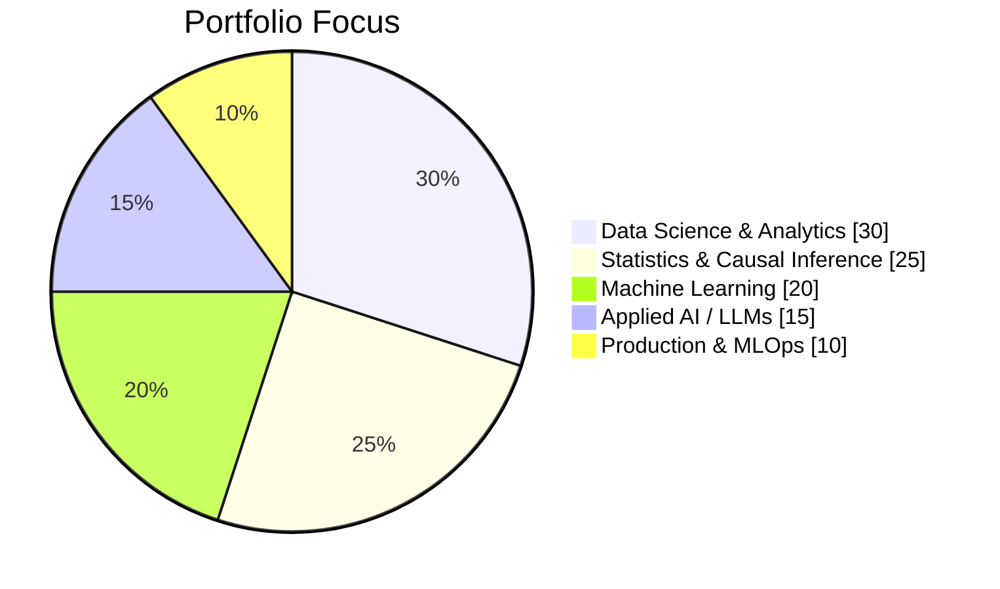
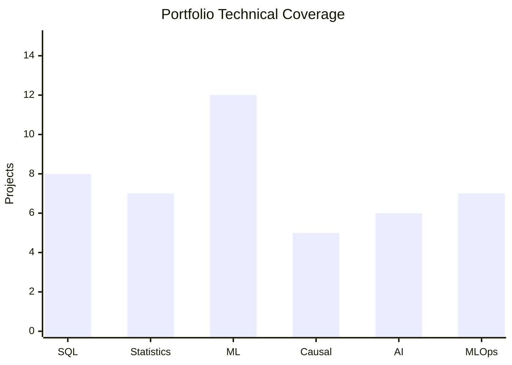

<div align="center">

# Hi 👋, I'm Harshith Devaraja

### Data Scientist · Machine Learning Engineer · M.Sc. Applied Mathematics & Computing

**I build data products that connect statistical reasoning, machine learning, and production engineering to measurable decisions.**

<p>
  <a href="https://www.linkedin.com/in/harshith-devaraja-087ba0228"></a>
  <a href="mailto:harshikollur302@gmail.com"></a>
  <a href="https://github.com/Harshithpatali"></a>
</p>

</div>

---

## 🧭 What I Work On

| 📊 Data Science | 🤖 Machine Learning | 🧠 Applied AI |
|:---|:---|:---|
| SQL · Statistics | Tabular ML · Forecasting | RAG · LLM Applications |
| A/B Testing · Causal Inference | XGBoost · LightGBM | LLM Evaluation |
| Business Analytics | Explainable AI | APIs · Cloud · MLOps |

My strongest interest is at the intersection of **experimentation, causal inference, machine learning, and production AI systems**.

---

## 📊 My Data Science Portfolio — At a Glance




> **My portfolio is built around a complete decision loop:** data → statistical reasoning → modeling → evaluation → business decision → deployment.

---

## 🚀 Featured Portfolio

> **A curated portfolio of 15 projects.** Older and experimental repositories remain available on my GitHub; the curated index makes the strongest work easier to review.

👉 **[View the complete Selected Portfolio →](portfolio/)**

### 🛒 Brazilian E-Commerce Data Science

**SQL-first marketplace analytics + leakage-safe churn ML + experimentation + deployment.**

[Repository](https://github.com/Harshithpatali/brazilian-ecommerce-data-science) · [Live Dashboard](https://olist-ecommerce-ds.streamlit.app/)

- PostgreSQL / Supabase analytical data model
- Grain-safe SQL transformations and validation
- RFM, cohorts, product, seller, delivery and geographic analytics
- Point-in-time customer churn dataset with temporal validation
- Logistic Regression, Random Forest and HistGradientBoosting
- MLflow experiment tracking
- Streamlit + Plotly decision dashboard

### 📦 Retail Demand & Inventory Optimization

**Demand forecasting connected directly to cost-aware inventory decisions.**

[Repository](https://github.com/Harshithpatali/retail-demand-inventory-optimization) · [Live Dashboard](https://retail-demand-inventory-optimization-v1.streamlit.app/) · [API](https://retail-demand-inventory-optimization.onrender.com/)

**Forecast → uncertainty → inventory policy → simulation → business impact**

- Naive, Seasonal Naive and Moving Average baselines
- XGBoost + LightGBM forecasting
- Leakage-safe time-based validation
- Out-of-sample uncertainty estimation
- Periodic-review `(R, S)` inventory optimization
- Held-out cost and service-level evaluation
- FastAPI + Streamlit deployment

### 🧪 Causal Experimentation Platform

**A complete experimentation pipeline from randomization checks to business ROI.**

[Repository](https://github.com/Harshithpatali/causal_experimentation_platform)

```text
Experiment Validation
        ↓
A/B Test + Power / MDE
        ↓
ATE / ATT
        ↓
S / T / X Learners
        ↓
CATE + Qini / AUUC
        ↓
Targeting Policy
        ↓
Incremental Conversions → Revenue → Profit → ROI
```

Criteo Uplift · SRM · SMD · Bootstrap CI · Meta-learners · LightGBM · FastAPI · Streamlit

### 🎯 Causal Uplift Marketing Optimization

**Customer-level treatment targeting using randomized email experiments.**

[Repository](https://github.com/Harshithpatali/causal-uplift-marketing-optimization)

- Hillstrom MineThatData — 64,000 customers
- ATE and heterogeneous treatment effects
- Two-Model / T-Learner and Class Transformation approaches
- Qini, AUUC and Uplift@10/20/30%
- Held-out policy evaluation
- Estimated incremental conversions and revenue

> Policy figures are estimates from held-out randomized evaluation, not guaranteed future campaign results.

---

## 🤖 Applied AI & LLM Systems

### 🧠 LLM Reliability & Evaluation Platform

[Repository](https://github.com/Harshithpatali/llm-evaluation-platform) · [Live Dashboard](https://llm-evaluation-platform-q.streamlit.app/) · [API](https://llm-evaluation-platform-1.onrender.com/docs)

**FastAPI + Celery + Redis + Groq + statistical drift monitoring + Streamlit observability.**

Evaluates LLM responses asynchronously and monitors reliability using **KS tests, Wasserstein distance, telemetry, latency and evaluation-score distributions**.

### 💹 Financial Intelligence Agent

[Repository](https://github.com/Harshithpatali/financial-intelligence-agent) · [Live Demo](https://financial-intelligence-agent-g.streamlit.app/)

Annual reports → document processing → BGE embeddings → ChromaDB → semantic retrieval → Groq → source-grounded answers → financial dashboard.

### ⚖️ Indian Legal Copilot

[Repository](https://github.com/Harshithpatali/Indian-Legal-Copilot-RAG-Powered-Legal-AI-Assistant)

Domain-specific RAG and applied NLP for legal information workflows.

### 📚 Math RAG Chatbot

[Repository](https://github.com/Harshithpatali/math-rag-chatbot) · [Live Demo](https://math-rag-chatbot-314201399185.europe-west1.run.app/)

FAISS + `all-MiniLM-L6-v2` + FLAN-T5 + LangChain + Streamlit for retrieval-augmented Linear Algebra explanations.

---

## 📈 Quantitative & Specialized ML

| Project | Focus |
|---|---|
| [Quant Trading Research](https://github.com/Harshithpatali/quant-trading-research) | Quantitative research and financial modeling |
| [FinRisk Engine](https://github.com/Harshithpatali/FinRisk-Engine) | Financial risk analytics / ML |
| [Bank Marketing GNN](https://github.com/Harshithpatali/Bank-Marketing-GNN) | Graph machine learning |
| [❤️ Haar ECG](https://github.com/Harshithpatali/Haar_ECG) | Haar wavelets + CNN/SVM + ECG classification |
| [👥 Employee Attrition Risk Intelligence](https://github.com/Harshithpatali/employee-attrition-risk-intelligence) | Predictive analytics and risk modeling |

---

## 🛠️ Technical Toolkit

### 🐍 Languages & Data

<p>


</p>

`🐍 Python` · `🗄️ SQL` · `🐘 PostgreSQL` · `🐼 Pandas` · `🔢 NumPy` · `📐 SciPy`

### 📐 Statistics & Machine Learning

<p>


</p>

`📊 scikit-learn` · `🚀 XGBoost` · `⚡ LightGBM` · `🧪 MLflow` · `🔎 SHAP`  
`🎲 Causal Inference` · `🧫 A/B Testing` · `🎯 Uplift Modeling` · `📈 Forecasting`

### 🧠 AI / NLP

<p>


</p>

`🔗 RAG` · `🦜 LangChain` · `⚡ FAISS` · `🗂️ ChromaDB` · `🧬 Sentence Transformers` · `⚖️ LLM Evaluation`

### 🚀 Engineering & Deployment

<p>


</p>

`⚡ FastAPI` · `🎈 Streamlit` · `🐳 Docker` · `🔧 Git` · `☁️ GCP` · `🌐 Render` · `🗃️ Supabase` · `🔴 Redis` · `⚙️ Celery`

---

## 📊 Skills → Project Coverage



> **Visual summary:** the portfolio is intentionally strongest in **Machine Learning, SQL/Data Science, Statistics, Causal Inference, and production AI** rather than being a collection of unrelated demo projects.

---

## 📊 GitHub Activity

<div align="center">


<br/>


</div>

---

## 🎓 Education

**M.Sc. Applied Mathematics & Computing**  
Manipal Academy of Higher Education

### Certifications / Coursework

- IBM Machine Learning with Python & Scikit-learn
- IBM Generative AI Engineering with LLMs Specialization
- IBM Applied Data Science Specialization
- Machine Learning — University of Michigan
- Python Programming — Duke University

---

## 🔬 Currently Exploring

- **Causal inference & experimentation** — heterogeneous treatment effects, sequential testing, policy evaluation
- **Production AI** — RAG, LLM evaluation, API architecture, cloud deployment
- **Financial AI** — research assistants, retrieval pipelines, quantitative workflows
- **MLOps** — experiment tracking, validation, deployment and monitoring

---

## 📫 Let's Connect

<div align="center">

I'm interested in **Data Science, Machine Learning, Experimentation, Causal Inference, and Applied AI**.

<a href="https://www.linkedin.com/in/harshith-devaraja-087ba0228"></a>
<a href="mailto:harshikollur302@gmail.com"></a>

<br/><br/>

<i>Build systems. Measure impact. Explain the model. Ship the result.</i>

</div>
