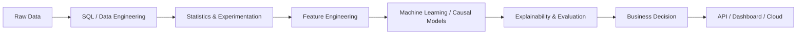
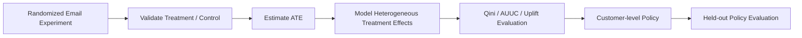
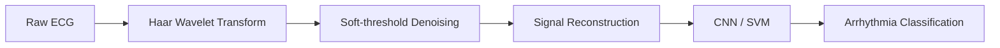

<div align="center">

# Hi 👋, I'm Harshith Devaraja

### Data Scientist · Machine Learning Engineer · M.Sc. Applied Mathematics & Computing

**I build production-oriented AI systems that turn data into measurable decisions.**

From SQL analytics and experimentation to machine learning, causal inference, RAG, explainability, APIs, and cloud deployment.

<p>
  <a href="https://www.linkedin.com/in/harshith-devaraja-087ba0228"></a>
  <a href="mailto:harshikollur302@gmail.com"></a>
  <a href="https://github.com/Harshithpatali"></a>
</p>

</div>

---

## 🧭 What I Work On

<table>
<tr>
<td width="33%" align="center">
<h3>📊 Data Science</h3>
SQL · Statistics · Experimentation<br/>
Feature Engineering · Business Analytics
</td>
<td width="33%" align="center">
<h3>🤖 Machine Learning</h3>
Tabular ML · Time Series · NLP<br/>
Deep Learning · Explainable AI
</td>
<td width="33%" align="center">
<h3>🧠 Applied AI</h3>
RAG · LLM Applications · Causal Inference<br/>
APIs · Cloud Deployment · MLOps
</td>
</tr>
</table>

I am particularly interested in problems where **statistical reasoning + machine learning + engineering** have to work together rather than being treated as separate disciplines.

---

## 🚀 Featured Work

> **My portfolio is organized around the complete path from data → inference → model → decision → deployment.**



### 🥇 E-Commerce Customer & Product Intelligence

**Production-style data science platform built on the Brazilian Olist e-commerce dataset.**

<a href="https://github.com/Harshithpatali/ecommerce-intelligence"></a>
<a href="https://ecommerce-intell.streamlit.app/"></a>
<a href="https://ecommerce-intelligence-xod0.onrender.com/docs"></a>

**Why it stands out:** this is not just a model or notebook. It combines **SQL analytics, customer-level feature engineering, CLV prediction, segmentation, SHAP explainability, retention prioritization, product recommendations, business intelligence, an LLM insight layer, FastAPI, and Streamlit** in one system.

```text
Olist Transactions
       ↓
PostgreSQL / Supabase
       ↓
SQL Analytics + Customer Features
       ↓
┌──────────────┬──────────────┬─────────────────┐
│ CLV          │ Segmentation │ Recommendations │
│ XGBoost      │ Behavioral   │ Product Ranking │
└──────────────┴──────────────┴─────────────────┘
       ↓
SHAP + Retention Intelligence
       ↓
Business Metrics
       ↓
Groq LLM → Natural-language insights
       ↓
FastAPI → Streamlit Dashboard
```

**Stack:** `Python` `SQL` `PostgreSQL` `Supabase` `XGBoost` `SHAP` `FastAPI` `Streamlit` `Plotly` `Groq`

**Core outputs:**
- Customer Lifetime Value prediction
- Customer segmentation
- Customer-level and global SHAP explanations
- High-value inactive customer identification
- Retention priority and recommended actions
- Personalized product recommendations
- Batch prediction and business intelligence APIs
- AI-generated business summaries

<details>
<summary><strong>📐 Technical depth</strong></summary>

The architecture deliberately separates responsibilities:

- **SQL** handles relational aggregation and analytical querying.
- **Python** handles feature engineering and application logic.
- **XGBoost** handles nonlinear tabular prediction.
- **SHAP** explains model behavior at global and customer level.
- **LLM** converts already-computed analytical results into business narrative.
- **FastAPI** exposes production-style REST endpoints.
- **Streamlit** acts as the presentation layer rather than containing ML logic.

</details>

---

### 🥈 Causal Uplift Modeling for Marketing Optimization

**From randomized experimentation to customer-level treatment policy.**

<a href="https://github.com/Harshithpatali/causal-uplift-marketing-optimization"></a>

Using the **Hillstrom MineThatData email experiment (64,000 customers)**, this project asks a more useful question than ordinary conversion prediction:

> **Who should receive which treatment to maximize incremental response?**



**Headline evaluation results from the repository:**

| Metric | Result |
|---|---:|
| Men's conversion lift | **0.68%** |
| Women's conversion lift | **0.31%** |
| Best uplift model | **Class Transformation — Men's Email vs Control** |
| Best AUUC | **0.002054** |
| Best Qini | **0.004129** |
| Uplift @ 10% | **0.63%** |
| Uplift @ 20% | **0.41%** |
| Uplift @ 30% | **0.55%** |
| Estimated incremental conversions at 50% targeting depth | **41.9** |
| Estimated incremental revenue at 50% targeting depth | **$6,051** |

> Policy impact figures are estimates from held-out randomized evaluation, not guaranteed future campaign results.

**Stack:** `Python` `LightGBM` `Causal Inference` `Uplift Modeling` `Qini` `AUUC` `Streamlit`

---

### 🥉 Math RAG Chatbot

**A retrieval-augmented assistant for step-by-step Linear Algebra explanations.**

<a href="https://github.com/Harshithpatali/math-rag-chatbot"></a>
<a href="https://math-rag-chatbot-314201399185.europe-west1.run.app/"></a>

```text
User Question
     ↓
Sentence Transformer Embedding
     ↓
FAISS Semantic Search
     ↓
Relevant Textbook Context
     ↓
FLAN-T5 Generation
     ↓
Step-by-step Explanation + Source Context
```

- `all-MiniLM-L6-v2` embeddings
- FAISS vector retrieval
- Google FLAN-T5 generation
- LangChain orchestration
- Streamlit conversational interface
- Dockerized deployment on Google Cloud Run

**Stack:** `Python` `LangChain` `FAISS` `Sentence Transformers` `Hugging Face` `FLAN-T5` `Streamlit` `Docker` `GCP`

---

### 📈 Bayesian & Sequential Experimentation Platform

**A research-oriented environment for learning and validating rigorous A/B testing.**

<a href="https://github.com/Harshithpatali/bayesian-sequential-experimentation"></a>

The project focuses on a common real-world experimentation problem: **what happens when teams repeatedly look at an experiment before it is finished?**

| Area | Methods |
|---|---|
| Power | Sample-size calculation, power curves, Cohen's h |
| Frequentist | Two-proportion z-test, confidence intervals |
| Bayesian | Beta-Binomial, posterior probability, expected loss |
| Sequential | Classic vs always-valid p-values |
| Multiple testing | Bonferroni, Holm, Benjamini-Hochberg FDR |
| Simulation | Synthetic experiments with known ground truth |

**Stack:** `Python` `Statistics` `Bayesian Inference` `A/B Testing` `Sequential Testing` `Monte Carlo` `Streamlit`

---

### 🩺 Haar_ECG — ECG Denoising & Arrhythmia Detection

**Signal processing + machine learning for ECG analysis.**

<a href="https://github.com/Harshithpatali/Haar_ECG"></a>



- Haar wavelet soft-threshold denoising
- Wavelet coefficient visualization
- CNN and SVM arrhythmia classifiers
- MIT-BIH Arrhythmia Database support
- Interactive Streamlit upload-and-predict workflow

**Stack:** `Python` `Haar Wavelets` `CNN` `SVM` `Signal Processing` `Streamlit`

---

## 🧩 Other Selected Work

<table>
<tr>
<td width="50%">

### 🛒 Customer Churn Prediction

<a href="https://github.com/Harshithpatali/customer_churn_pipeline">Repository</a>

Random Forest + XGBoost ensemble with MLflow tracking and ROC-AUC **0.88** as documented in the project.

</td>
<td width="50%">

### ❤️ Heart Attack Risk Prediction

<a href="https://github.com/Harshithpatali/heart-attack-risk-prediction">Repository</a>

CatBoost-based risk modeling with regional mapping / visualization components.

</td>
</tr>
<tr>
<td width="50%">

### 💹 Financial Intelligence

<a href="https://github.com/Harshithpatali/financial-intelligence-agent">Repository</a>

Exploring AI-assisted financial analysis and agentic workflows.

</td>
<td width="50%">

### 🧪 LLM Evaluation Platform

<a href="https://github.com/Harshithpatali/llm-evaluation-platform">Repository</a>

Focused on systematic evaluation of LLM-powered applications.

</td>
</tr>
</table>

---

## 🛠️ Technical Toolkit

<div align="center">

### Languages & Data


### Machine Learning & AI


### Engineering & Deployment


</div>

---

## 📊 GitHub Activity

<div align="center">


<br/>


</div>

---

## 🎓 Education & Learning

**M.Sc. Applied Mathematics & Computing**  
Manipal Academy of Higher Education

### Certifications / Coursework

- IBM Machine Learning with Python & Scikit-learn
- IBM Generative AI Engineering with LLMs Specialization
- IBM Applied Data Science Specialization
- Machine Learning — University of Michigan
- Python Programming — Duke University

---

## 🔬 Currently Exploring

- **Causal inference & experimentation:** heterogeneous treatment effects, sequential testing, policy evaluation
- **Production AI:** RAG systems, LLM evaluation, API architecture, cloud deployment
- **Financial AI:** research assistants, retrieval pipelines, quantitative workflows
- **MLOps:** experiment tracking, model validation, deployment and monitoring

---

## 📫 Let's Connect

<div align="center">

If you're working on **data science, machine learning, experimentation, causal inference, or applied AI**, I'd be happy to connect.

<a href="https://www.linkedin.com/in/harshith-devaraja-087ba0228"></a>
<a href="mailto:harshikollur302@gmail.com"></a>

<br/><br/>

<i>Build systems. Measure impact. Explain the model. Ship the result.</i>

</div>
